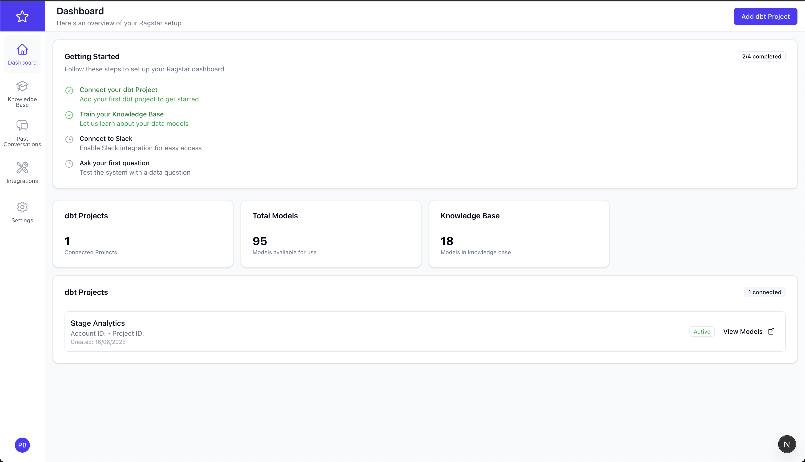
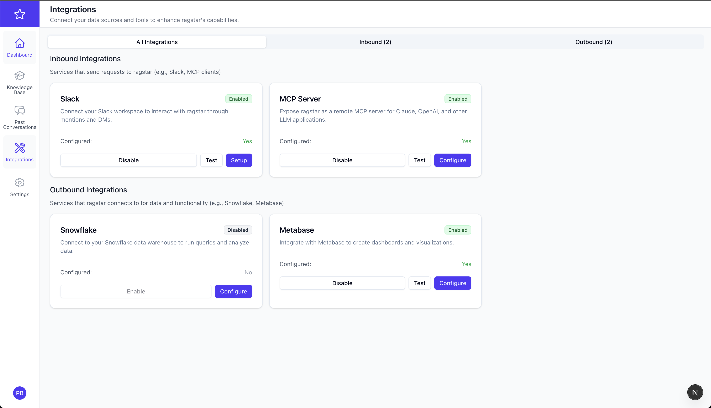
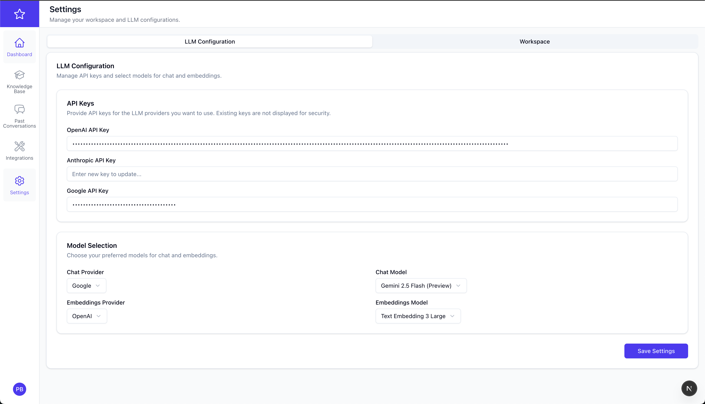

# Ragstar — AI Data Analyst for dbt Projects

[](https://opensource.org/licenses/MIT)
[](https://www.python.org/downloads/)
[](https://www.typescriptlang.org/)
[](https://docs.docker.com/compose/)

> **Ragstar is in public βeta.** Expect rapid changes and occasional rough edges.

---

## 1. What is Ragstar?

Ragstar connects to your **dbt** project, builds a knowledge base from models & documentation, and lets everyone ask data-related questions in plain English via a beautiful web dashboard or Slack. Under the hood Ragstar combines:

- PostgreSQL + `pgvector` for fast similarity search
- Embeddings + LLMs (OpenAI, Anthropic, etc.) for reasoning
- A modern **Next.js** frontend & **Django** backend

### Screenshots

#### Dashboard



#### Integrations



#### Settings



---

## 2. Quick start (🚀 2 commands)

```bash
# ① clone & prepare env file
$ git clone https://github.com/pragunbhutani/ragstar.git && cd ragstar
$ cp .env.example .env && ${EDITOR:-vi} .env  # ⇒ edit just the vars shown below

# ② build & run everything
$ docker compose up --build -d
```

When the containers are healthy:

- Frontend: http://localhost:3000 (Next.js)
- API: http://localhost:8000 (Django/DRF)
- Flower: http://localhost:5555 (background tasks)

Run first-time Django tasks:

```bash
# inside the running backend container
$ docker compose exec backend-django \
    uv run python manage.py migrate
```

🎉 That's it — open http://localhost:3000, sign up for a new account and you're ready to start using Ragstar.

---

## 3. Environment variables

Only a handful of variables are truly **required** for a local/dev install. The rest are advanced overrides.

Ragstar keeps the default stack as lightweight as possible.  
For a **local `docker compose` run you only need 3 variables** – everything else has sane fall-backs.

### 3.1 Required for local/dev

| Var                   | Example                   | Purpose                                              |
| --------------------- | ------------------------- | ---------------------------------------------------- |
| `NEXTAUTH_SECRET`     | `openssl rand -base64 32` | Secret used by **next-auth** to sign session cookies |
| `NEXTAUTH_URL`        | `http://localhost:3000`   | Public URL where the frontend is reachable           |
| `NEXT_PUBLIC_API_URL` | `http://localhost:8000`   | Public URL of the Django API exposed to the browser  |

Create a `.env` file in the repo root and paste the three lines above (adjust URLs if you changed the ports).

### 3.2 Common overrides (optional)

| Var                                                                | Default                      | When you might set it                                                                                  |
| ------------------------------------------------------------------ | ---------------------------- | ------------------------------------------------------------------------------------------------------ |
| `INTERNAL_API_URL`                                                 | `http://backend-django:8000` | Only needed when the frontend talks to the backend across Docker networks or remote hosts.             |
| `ENVIRONMENT`                                                      | `local`                      | Switch between `local`, `development`, `production` behaviour inside Django settings.                  |
| `APP_HOST`                                                         | —                            | Extra hostname to append to Django `ALLOWED_HOSTS` & CORS lists, e.g. your public Ngrok / Vercel host. |
| `DATABASE_URL`                                                     | auto-generated by compose    | Point the backend & worker to your own Postgres instance.                                              |
| `CELERY_BROKER_URL`                                                | `redis://redis:6379/0`       | Use an external Redis / RabbitMQ instead of the bundled one.                                           |
| `AWS_ACCESS_KEY_ID`, `AWS_SECRET_ACCESS_KEY`, `AWS_DEFAULT_REGION` | not set                      | **Only required when you disable LocalStack and want to store secrets in real AWS Parameter Store.**   |

### 3.3 LLM Provider API Keys

You need to provide API keys for all the LLM providers you plan on using.

```bash
LLM_OPENAI_API_KEY=...
LLM_ANTHROPIC_API_KEY=...
LLM_GOOGLE_API_KEY=...
```

### 3.4 Postgres defaults (used by compose)

```bash
POSTGRES_DB=ragstar
POSTGRES_USER=user
POSTGRES_PASSWORD=password
POSTGRES_PORT=5432
```

Set a single `EXTERNAL_POSTGRES_URL=<url>` to BYO Postgres (with the `pgvector` extension).

---

## 4. First-run onboarding

After logging into the dashboard you'll be guided through these steps:

1. **Add a dbt project** → _Projects › New_ (dbt **Cloud** recommended — just paste the service token). GitHub or local zip upload also supported.
2. **Pick the dbt models you want to use for answering questions** → choose which model to use for ∙ questions ∙ embeddings ∙ SQL verification.
3. **Configure Slack** (optional)
   - Go to _Integrations › Slack_.
   - Follow the inline manifest to create a Slack app.
   - Paste **Bot Token**, **Signing Secret**, **App Token**.
4. **Ask questions!** Use the chat on the dashboard or `/ask` in Slack.

> Other integrations (Metabase, Snowflake, MCP) are available under _Integrations_ but currently **βeta / experimental**. MCP server is temporarily disabled while we stabilise streaming support.

---

## 5 Managing the stack

Common operations are wrapped in one-liners:

```bash
# shell into backend or frontend
$ docker compose exec backend-django bash
$ docker compose exec frontend-nextjs sh

# tail logs
$ docker compose logs -f backend-django

# stop / remove containers
docker compose down          # keep volumes
docker compose down -v       # destroy DB
```

---

## 6. Local dev without Docker (advanced)

1. Install **Python 3.10+**, **Node 18+**, **uv**, **pnpm**, and Postgres16+ with `pgvector`.
2. `uv venv && source .venv/bin/activate && uv pip install -e backend_django/`
3. `pnpm install --filter frontend_nextjs`
4. Start services in two terminals:
   - **Backend** — `cd backend_django && uv run python manage.py runserver 0.0.0.0:8000`
   - **Frontend** — `cd frontend_nextjs && pnpm dev`
5. Export the same env vars listed above.

Docker is strongly recommended unless you're hacking on the codebase itself.

---

## 7. Contributing

We 💛 community PRs. Please file an issue first for major changes. Make sure `ruff`, `black`, `mypy`, and `eslint` pass before opening a pull request.

---

---

## 8. MCP Server Integration (Self-Hosted Only)

Ragstar includes a **Model Context Protocol (MCP)** server that allows LLM clients like Claude.ai to directly access your dbt knowledge base. The MCP server provides secure, OAuth-authenticated access to your dbt models and project information.

> **⚠️ Important:** The MCP server can only be used with **self-hosted/open source** deployments of Ragstar. This is due to the **1:1 relationship** between an MCP client and server — each client needs its own dedicated server instance.

### 8.1 What is the MCP Server?

The MCP server acts as a bridge between LLM clients (like Claude.ai) and your Ragstar knowledge base. It provides:

- **Secure OAuth 2.0 authentication** with PKCE
- **Organization-scoped access** to dbt models and projects
- **Real-time data access** without manual imports
- **Semantic search** capabilities across your dbt documentation
- **Detailed model information** including SQL, lineage, and metadata

### 8.2 Available MCP Tools

The MCP server exposes these tools to LLM clients:

- `list_dbt_models` — Browse and filter dbt models by project, schema, or materialization
- `search_dbt_models` — Semantic search for relevant models using natural language
- `get_model_details` — Get detailed information about specific models including SQL and lineage
- `get_project_summary` — Overview of connected dbt projects and their structure

### 8.3 Setting Up the MCP Server

#### Prerequisites

1. **Self-hosted Ragstar** running with Docker Compose
2. **dbt project connected** and models loaded in your knowledge base
3. **LLM client** that supports MCP (e.g., Claude.ai, ChatGPT with MCP support)

#### Configuration

The MCP server runs on port `8080` by default. Add these environment variables to your `.env` file:

```bash
# MCP Server Configuration
MCP_AUTHORIZATION_BASE_URL=http://localhost:8000  # Your Django backend URL
DJANGO_BACKEND_URL=http://localhost:8000          # Backend URL for MCP server
ALLOWED_ORIGINS=*                                 # Or specific origins for security
```

#### Starting the MCP Server

The MCP server is included in the Docker Compose stack:

```bash
# Start all services including MCP server
docker compose up -d

# Check MCP server health
curl http://localhost:8080/health
```

### 8.4 OAuth 2.0 Flow Explanation

The MCP server implements a complete OAuth 2.0 authorization flow with organization-scoped access. Here's how it works:

#### Flow Overview

```mermaid
sequenceDiagram
    participant Claude as Claude.ai
    participant MCP as MCP Server
    participant Django as Django Backend
    participant User as User Browser

    Claude->>MCP: 1. Request OAuth metadata
    MCP->>Django: 2. Proxy metadata request
    Django->>MCP: 3. Return OAuth configuration
    MCP->>Claude: 4. OAuth server metadata

    Claude->>MCP: 5. Authorization request (with PKCE)
    MCP->>Django: 6. Proxy authorization request
    Django->>User: 7. Redirect to frontend login
    User->>Django: 8. Authenticate via Next.js
    Django->>MCP: 9. Authorization code
    MCP->>Claude: 10. Return authorization code

    Claude->>MCP: 11. Exchange code for tokens
    MCP->>Django: 12. Validate and exchange
    Django->>MCP: 13. Access & refresh tokens
    MCP->>Claude: 14. JWT tokens

    Claude->>MCP: 15. API calls with Bearer token
    MCP->>Django: 16. Validate token & get user context
    Django->>MCP: 17. Organization-scoped data
    MCP->>Claude: 18. Formatted response
```

#### Key Components

1. **OAuth Metadata Discovery**: MCP server exposes RFC 8414 compliant metadata endpoints
2. **PKCE Security**: Uses Proof Key for Code Exchange for enhanced security
3. **Auto-Registration**: Automatically registers new OAuth clients (like Claude.ai)
4. **Organization Scoping**: All data access is automatically scoped to the user's organization
5. **JWT Tokens**: Secure, stateless authentication using JSON Web Tokens

#### Security Features

- **PKCE (Proof Key for Code Exchange)**: Prevents authorization code interception attacks
- **Organization Isolation**: Users can only access their organization's data
- **Token Validation**: All API calls require valid JWT tokens
- **Automatic Expiry**: Access tokens expire after 1 hour, refresh tokens after 7 days

### 8.5 Connecting Claude.ai to Your MCP Server

#### Step 1: Configure MCP in Claude.ai

1. Go to Claude.ai settings
2. Find the "MCP Servers" or "Model Context Protocol" section
3. Add a new server with these details:
   - **Server URL**: `http://localhost:8080` (or your public URL)
   - **OAuth**: Enable OAuth 2.0 authentication
   - **Auto-discovery**: Enable to automatically discover capabilities

#### Step 2: Authorize the Connection

1. Claude.ai will redirect you to your Ragstar login page
2. Sign in with your Ragstar account
3. You'll be redirected back to Claude.ai with authorization
4. The connection will be linked to your organization

#### Step 3: Start Using MCP Tools

You can now ask Claude.ai to:

- "List all my dbt models"
- "Search for revenue-related models"
- "Show me details about the customer_metrics model"
- "What dbt projects do I have connected?"

### 8.6 Example MCP Interactions

#### Listing Models

```
You: "What dbt models do I have available?"
Claude: [Calls list_dbt_models tool]
Claude: "You have 23 dbt models across 2 projects:
- analytics_prod: 15 models (staging, marts schemas)
- marketing_analytics: 8 models (staging, reporting schemas)
..."
```

#### Searching Models

```
You: "Find models related to customer revenue"
Claude: [Calls search_dbt_models with "customer revenue"]
Claude: "I found 3 relevant models:
- customer_revenue_monthly (similarity: 0.95)
- customer_ltv_calculation (similarity: 0.87)
- revenue_attribution (similarity: 0.82)
..."
```

#### Getting Model Details

```
You: "Show me the SQL for customer_revenue_monthly"
Claude: [Calls get_model_details for "customer_revenue_monthly"]
Claude: "Here's the customer_revenue_monthly model:
- Schema: marts
- Materialization: table
- SQL: SELECT customer_id, DATE_TRUNC('month', order_date) as month, SUM(amount) as revenue FROM..."
```

### 8.7 Troubleshooting MCP Connection

#### Common Issues

1. **Authentication Fails**: Check that your Ragstar backend is accessible and you're logged in
2. **No Models Found**: Ensure your dbt project is connected and models are loaded
3. **Permission Errors**: Verify the user has access to the organization's dbt projects
4. **Network Issues**: Check firewall settings and port accessibility

#### Debug Commands

```bash
# Check MCP server health
curl http://localhost:8080/health

# Test OAuth metadata
curl http://localhost:8080/.well-known/oauth-authorization-server

# View MCP server logs
docker compose logs -f mcp-server
```

### 8.8 Production Deployment

For production use:

1. **Use HTTPS**: Configure SSL certificates for secure connections
2. **Restrict Origins**: Set specific allowed origins instead of `*`
3. **Monitor Usage**: Track OAuth token usage and API calls
4. **Scale Considerations**: Each client needs its own server instance

### 8.9 Limitations

- **1:1 Client-Server Relationship**: Each MCP client needs its own server instance
- **Organization Scoping**: Users can only access their own organization's data
- **Token Expiry**: Access tokens expire after 1 hour (refresh tokens after 7 days)
- **Self-Hosted Only**: Not available in hosted/SaaS deployments

---

## 9. Contributing

We 💛 community PRs. Please file an issue first for major changes. Make sure `ruff`, `black`, `mypy`, and `eslint` pass before opening a pull request.

---

## 10. License

Ragstar is released under the MIT License — see [LICENSE](./LICENSE).
